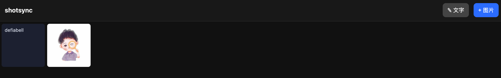

[English](README.md) | 简体中文

# shotsync

属于你自己的跨设备图片 & 文字中转池，几分钟就能部署到 Cloudflare 免费档。在一台设备上截图或存图，另一台设备随手就能拿到。手机端无需装 App（是 PWA），不经任何第三方图床——数据只待在你自己的 Cloudflare 账户里。



## 这是什么

一个 **Cloudflare Worker + R2 存储桶**，配一个**网页相册（PWA）**：

- 上传**图片**（浏览器端转 JPEG + 生成缩略图）和**文字**片段。
- 任意设备倒序看瀑布流，点开可**保存/下载**、**删除**。
- 给单个 item 生成**带签名、会过期的公开链接**分享出去——而不暴露池子里的其余内容。
- **token 门禁**：一个共享密钥解锁整个池子，其余一律私有。
- 一个 **30 天自动清理的中转池**，不是归档仓库。

## 为什么

iCloud / AirDrop / 网盘 / 公开图床，要么手动、要么锁死在某个生态、要么把（可能含工作内容的）截图过别人的云。shotsync 是一个自托管、免费、尊重隐私的方案：数据只在你自己的设备和你自己的 Cloudflare 账户之间流转。

## 功能

- 跨设备图片 + 文字池（共享剪贴板 + 截图落点）
- PWA 相册——「添加到主屏幕」，无需原生 App、不上应用商店
- 客户端 HEIC→JPEG + 缩略图生成（省流量；Worker 不做图像处理）
- 带签名、会过期的公开分享链接（HMAC-SHA256，7 天）
- 单个保存/下载 + 多选批量删除
- 单 token 鉴权、constant-time 比较、token 永不进 URL
- 30 天自动留存（R2 lifecycle）
- 完全跑在 Cloudflare 免费档（Workers + R2）
- ~50 个测试（Vitest + `@cloudflare/vitest-pool-workers`）

## 自己部署（约 5 分钟）

前置：一个 Cloudflare 账户、Node 18+、并**启用 R2**（控制台 → R2 → 启用；即使免费档 Cloudflare 也会要求绑卡——免费额度内不扣费）。

```bash
git clone https://github.com/Defiabell/shotsync
cd shotsync
npm install
npx wrangler login

# 1. 建 R2 存储桶（名字要和 wrangler.toml 里的 bucket_name 一致）
npx wrangler r2 bucket create shotsync

# 2. 设置共享访问 token —— 任意长随机串；每台设备要输它
openssl rand -hex 24                  # 生成一个，复制下来
npx wrangler secret put AUTH_TOKEN    # 提示时粘贴

# 3. 部署
npm run deploy
```

你还需要一个 **workers.dev 子域名**（控制台 → Workers & Pages，一次性）或自定义域名。部署后会得到 `https://shotsync.<你的子域>.workers.dev`。

### 30 天自动清理

控制台 → R2 → 桶 `shotsync` → Settings → Object lifecycle rules → 对象创建 30 天后删除。

## 使用

界面按钮是中文，下面直接对应你看到的按钮。

### 1. 每台设备首次使用
1. 打开你的 Worker 地址（如 `https://shotsync.<你的子域>.workers.dev`）。
2. 弹框时输入你的 `AUTH_TOKEN` —— 它存在 `localStorage`，之后这台设备不再问。
3. （可选）Safari 里 **分享 → 添加到主屏幕**，装成 PWA，像 App 一样全屏运行。

相册倒序展示所有 item，约每 20 秒自动刷新，所以其它设备传的东西几秒内就会出现。

### 2. 往池子里加东西
- **图片** —— 点 **`+ 图片`**：从相册或相机选。浏览器端转成 JPEG + 缩略图后上传。
- **文字** —— 点 **`✎ 文字`**，粘贴/输入片段，点 **`发送`**。变成一张文字卡片——跨设备剪贴板。
- **Mac 截图（自动）** —— 装上 [Mac 菜单栏 App](mac/README.md)：每次截图自动上传。
- **iOS 分享菜单** —— 配一个[快捷指令](shortcut/README.md)，从任意 App 的分享菜单推图进来。

### 3. 点开单个 item
点任意缩略图/卡片全屏打开，然后：
- **`保存` / `复制`** —— 图片：存到相册（手机）或下载（桌面）；文字：复制到剪贴板。
- **`分享`** —— 为这一个 item 生成 **7 天有效的公开链接**并复制到剪贴板。拿到链接的人只能看这一个；池子其余部分仍私有。
- **`删除`** —— 删掉这个 item。
- **`关闭`** —— 返回相册。

### 4. 批量删除
1. 点 **`选择`** 进入多选模式。
2. 点 item 勾选（蓝框）；再点一下取消勾选。
3. 点 **`删除选中 (N)`** → 确认。或点 **`取消`** 不删退出。

## 安全模型与限制（请阅读）

- **单一共享 token。** 拿到「地址 + token」的任何人都能看/传/删。这是单人 / 可信小圈子工具，不是多租户。用 `npx wrangler secret put AUTH_TOKEN` 轮换——注意这会同时让所有现存分享链接失效（token 也是链接的签名密钥）。
- **分享链接是公开的**，直到过期（7 天）：拿到链接的人都能看那一个 item。
- **中转池，不是归档。** item 按设计 30 天后自动删除。
- **界面目前是中文。** 欢迎提 i18n PR。
- Worker 原样存收到的字节（不做服务端图像处理）；格式转换和缩略图都在客户端做。

## 开发

```bash
npm test          # Vitest（workers pool）—— 全套
npx tsc --noEmit  # 类型检查
npm run dev       # 本地开发 —— 建一个含 AUTH_TOKEN=<任意串> 的 .dev.vars
```

## License

[MIT](LICENSE)
